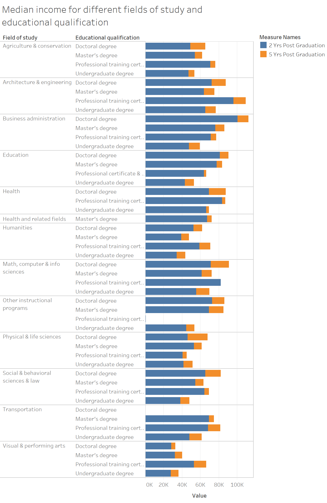

# Introduction to dataset - Why I chose to work on this
As a student, it is important to be aware of how to translate what you learned in school into the real world. One of the necessary translations is understanding how the market quantifies your contribution in the workforce. This is why I have taken an interest in Statistics Canada's dataset on Labour market outcomes for college and university graduates [found here](https://www150.statcan.gc.ca/n1/pub/71-607-x/71-607-x2019031-eng.htm). This specific dataset documents Class of 2012's income both 2 years after graduating, and 5 years after graduating. The variables "field of study" and "educational qualification" play significant roles in affecting income. 

# My goals
While I liked specific aspects of the visualization in Statistics Canada, I thought there were also other aspects that could be re-developed to better explore the dataset. My goal here is to critique the current visualization and wireframe a new solution. For the new solution, I want to gather feedback along the way so I could iterate and make it even better. 

# Critique of Statistics Canada's current visualization

What works well: 

Intuitiveness- The bar graph chosen is a commonly used data visualization, and therefore users are able to quickly grasp the content and objective. 

Limit use of colors- I like how there are only 2 colors used, light blue and dark blue. It conveys the contrast in income data effectively.

What doesn't work well:

Completeness- Only when I downloaded the dataset did I realize that there is an important variable that was not considered in the above visualization, which is field of study. Furthermore, the income actually differs a lot depending on field of study across the educational qualifications.

Truthfulness - It would be inaccurate to tell any student with a undergraduate degree that they can expect the median graduate income, if they went and obtained the graduate degree. Field of study is a attribute that is not exhibited, and it heavily impacts the income. The visualization does not depict the variability of income depending on field of study. 

# Wireframe a solution
I am a pen-and-paper kind of thinker, so I decided to wireframe on a piece of paper:

I showed all 3 options to a friend, and here is the feedback: 

Option 1:
- Friend: It doesn't make sense why you are stacking the degrees against income. Did you mean to show the proportion of degree within each field of study? 
- Me: Actually, I stacked the degrees to visually organize the information. I guess that didn't convey what I thought!

Option 2: 
- Friend: For this graph, it will be interesting to see how the same degree results in different income levels. Do you have to show all the field of studies? Seems complicated with all the bars...
- Me: Oh interesting, there may be some ways to combine certain datapoints here. For example, as I am revisiting the dataset, I could combine the 3 different kinds of professional qualifications to be one variable. 

Option 3: 
- Friend: Where is the 5 year outcome? I thought the goal is to compare and contrast 2 year and 5 year here (like you did in the previous option). The dot format is interesting, I can easily focus on the top incomes from different fields of study. 
- Me: I definitely want a solution that covers the entirety of my dataset. Maybe this is not the best way to move forward. 

In the end, I decided to move forward with Option 2 as the base of my solution, because it had the most comprehensive visualization of all variables in the dataset. I also wanted to see if the bars will indeed look overcrowded. 

# Solution-building, V.1
My initial solution via Tableau: 

Feedback from viewer 1: I like it! You can see how valuable each level of attainment is for each field is. For architecture & engineering, getting a masters degree doesn't help very much. For education it helps a lot! One thing I'd like to see, is the 2 levels (2 years after graduating, 5 years after graduating) overlay one another. So for business administration, if you can stack them, and the difference is in a different color, then the difference is obvious. 

Feedback from viewer 2: I think if I was a student, I would find this a great resource for figuring out what field of study I want to pursue, and whether obtaining a higher degree in that field of study would make a significant income difference. Is there something you could do about how wide this chart is? I have to keep going between year 2 and year 5 to understand what the differences are in income. Also, there are a lot of bars - I'm not quite sure how the top bars match up to the income scale on the bottom. 

My thoughts: It's interesting that both viewers suggested that somehow combining the 2 year and 5 year data would help them visually compare income. I can also label the bars with the actual values to help viewers get an accurate sense of income. 

# Solution-building, V.2

Iteration strategies: 

Stacked bars- Helped make the difference in income between 2 years vs. 5 years in each field of study clear. Whereas before, the eye had to wander between the two bars to imagine the difference. 

Contrasting colors in stacked bars- The 2 year income in blue is visually very different than 5 year income illustrated in orange. It helps make the difference glancible and easy to understand.

Labeling of bars- The labeling of bars helps viewers be able to accurately assess "high" and "low" income without having to look at the scale located at the bottom of the chart. 

# Summary of my process 
When I first saw the data visualization on the Statistics Canada website, I thought to myself "it's an interesting topic and I think the visualization already looks good". But then, when I compared the amount of insightful information in the actual dataset vs. what was visualized, I realized there is actually many missed opportunities - the biggest ones being: 1) The chance to compare and contrast income within both the same field of study but different educational qualification, and 2) different fields of study but same educational qualification. 

To help me think through some potential ideas to better visualize, I sketched some potential options on paper. This helps me avoid relying on pre-made charts online or Tableau. Next, I ran my ideas through a friend, who gave me some pros and cons of the ideas I generated. In one case (option 1), my friend told me that it actually makes no sense. But in my mind it did... so I'm glad I asked my friend to look at it! 

The feedback received from my initial ideas gave me enough reasons to pursue Option 2, and create my solution in Tableau. With my version 1 of solution done, I asked 2 other friends to review my chart. One friend immediately started voicing insights he gathered from looking at my chart, which I thought was a good sign. He then commented on some opportunities to improve, which I took back and used as a base to create version 2 of my solution.

# Sources & relevant links
Original data and initial visualization obtained from Statistics Canada. Table 37-10-0115-01 Characteristics and median employment income of longitudinal cohorts of postsecondary graduates two and five years after graduation, by educational qualification and field of study (alternative primary groupings), 2010 to 2012 cohorts [click here to view](https://www150.statcan.gc.ca/t1/tbl1/en/tv.action?pid=3710011501 DOI: https://doi.org/10.25318/3710011501-eng)

Tool used to visualize solution: Tableau [click here for more info](https://www.tableau.com/)

Public link to [access this page](https://eileenowang.github.io/LabourMarketOutcomes/)

[Return my main Data Visualization page](https://eileenowang.github.io/data-visualization/)

<noscript></noscript><object class='tableauViz'  style='display:none;'><param name='host_url' value='https%3A%2F%2Fpublic.tableau.com%2F' /> <param name='embed_code_version' value='3' /> <param name='path' value='shared&#47;MNR86DQM8' /> <param name='toolbar' value='yes' /><param name='static_image' value='https:&#47;&#47;public.tableau.com&#47;static&#47;images&#47;MN&#47;MNR86DQM8&#47;1.png' /> <param name='animate_transition' value='yes' /><param name='display_static_image' value='yes' /><param name='display_spinner' value='yes' /><param name='display_overlay' value='yes' /><param name='display_count' value='yes' /><param name='language' value='en' /><param name='filter' value='publish=yes' /></object>

